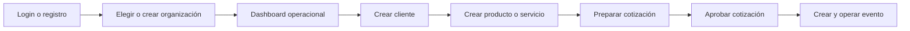

# User Flow

## Recorrido principal

El dashboard convierte el recorrido en una lista de primeros pasos y recomienda la siguiente acción según los datos existentes. Esto reduce la dependencia de entrenamiento previo.

## Rutas y objetivos

| Ruta | Objetivo principal | Siguiente acción |
| --- | --- | --- |
| `/login` | Acceder de forma segura | Elegir organización o continuar al dashboard |
| `/register` | Crear una cuenta | Crear organización |
| `/organizations` | Elegir el espacio de trabajo | Abrir organización activa |
| `/organizations/:id` | Entender el estado de la operación | Completar el siguiente paso recomendado |
| `/clients` | Administrar relaciones comerciales | Crear o abrir cliente |
| `/catalog` | Mantener productos y servicios | Crear ítem o usarlo en una cotización |
| `/quotations` | Gestionar propuestas y estados | Crear, enviar o versionar cotización |
| `/events` | Coordinar ejecución | Crear, confirmar y completar evento |

Las rutas de negocio reales incluyen el prefijo `/organizations/:organizationId`.

## Selección de organización

1. La persona consulta sus organizaciones.
2. Selecciona una organización permitida.
3. El contexto activo se muestra en la barra superior.
4. Navegación, acciones rápidas y paleta de comandos se filtran por permisos.
5. Al cerrar sesión se elimina el contexto y la pantalla pública vuelve a ser anónima.

## Recuperación

- Si una petición falla, se preserva el contexto de la vista y se muestra una acción de reintento cuando corresponde.
- Si no existe una organización, se presenta un estado vacío con acceso directo a crearla.
- Si faltan datos para cotizar, el dashboard recomienda cliente o catálogo antes de la cotización.
- Si el backend no está disponible, login informa conectividad y no lo confunde con credenciales inválidas.

## RBAC

La interfaz consulta permisos para módulos y acciones. Esta capa mejora orientación, pero no sustituye la autorización del API. Cada endpoint continúa validando organización, membresía y permiso.

