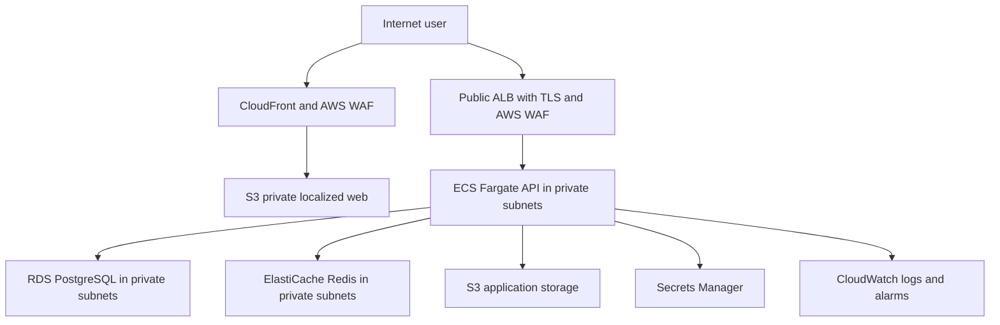

# Sprint 4A Infrastructure Validation

## Scope

This report certifies the reproducible AWS staging foundation declared in
Terraform for Kaklen. It validates source code and an offline plan only. No
AWS account, real AWS credential, remote state, resource deployment, or
`terraform apply` was used.

The machine-readable result is
[`artifacts/sprint-4a-infrastructure-validation.json`](../../artifacts/sprint-4a-infrastructure-validation.json).

## Immutable References

| Component | Validated reference |
| --- | --- |
| Kaklen technical changes | `c5250c752ae1b6798c8be20b7a0052c405fc45fd` |
| Kaklen baseline | `063f34fd4338bf01f0ee4eaaecab63cf629e0d87` |
| Pinned `vendor/kokecore` submodule | `b0025e737d94a1dae4be2f8f71dcdcfea72c695f` |
| Terraform | `1.15.8` |
| AWS provider | `6.55.0`, locked by checksum |
| TFLint | `0.64.0` |
| Trivy | `0.72.0` |

The evidence commit follows the technical commit and therefore cannot contain
its own SHA. GitHub Actions must validate the final pull request head before
this Sprint 4A result is accepted remotely.

## Declared Architecture

The configuration spans two availability zones. Only the ALB can reach the
API port, only ECS can reach PostgreSQL and Redis, and neither data service is
public. The frontend preserves `/es/`, `/en/`, and `/pt-BR/` routes through a
CloudFront Function and separate cache behavior for runtime configuration.

## Terraform Results

| Control | Result | Evidence |
| --- | --- | --- |
| Format | PASS | `terraform fmt -check -recursive infra` |
| Environment contract | PASS | 50 of 50 production runtime variables mapped |
| Initialization | PASS | Backend disabled; locked AWS provider from verified cache |
| Validation | PASS | `terraform validate -no-color` |
| Lint | PASS | All root and module directories checked by TFLint |
| Structural security | PASS | 45 Terraform files and seven security invariants |
| Trivy config | PASS | No unaccepted HIGH or CRITICAL finding |
| Staging plan | PASS | 96 add, 0 change, 0 destroy |
| Apply | NOT EXECUTED | Explicitly outside Sprint 4A scope |

The offline plan used synthetic provider credentials and disabled metadata
access. It performed no refresh and made no call that created or changed AWS
resources. The generated plan is intentionally ignored because it is a local,
binary build artifact.

## Clean Clone Validation

Validation ran in `/private/tmp/kaklen-sprint4a-retry.x2mA2H/repo`, created
from a recursive clone. The checkout and the Quality Gate artifact both
reported the exact technical SHA above. The submodule matched its pinned SHA,
and `pnpm install --frozen-lockfile` completed without modifying the lockfile.

| Control | Result |
| --- | --- |
| Frozen install | PASS |
| `pnpm infra:fmt` | PASS |
| `pnpm infra:validate` | PASS |
| `pnpm infra:lint` | PASS |
| `pnpm infra:security` | PASS |
| `pnpm infra:plan:staging` | PASS |
| Lint and typecheck | PASS |
| Unit and workspace tests | PASS |
| Workspace build | PASS |
| Localized builds and server | PASS |
| E2E and accessibility | PASS, 37 Playwright scenarios |
| API and web Docker images | PASS, `linux/amd64` |
| Canonical Quality Gate | PASS, 35 controls in 334156 ms |

The successful canonical run started at `2026-07-22T19:11:17.585Z`, finished
at `2026-07-22T19:16:51.740Z`, and ended with `QUALITY GATE PASSED`.

## Failure Found and Corrected

The first clean-clone gate reached the web image after every prior control had
passed, but a cold container dependency download consumed most of the fixed
ten-minute Docker timeout. The runner cancelled the third localized web build
at 600010 ms. Both Docker controls now allow 15 minutes, and a regression test
enforces that floor. The complete gate was repeated from a new recursive clone
and passed. No test, threshold, product behavior, or required control was
removed or weakened.

## Security Decisions

- ECS execution and task roles are separate. Secret, logging, ECR, S3, and KMS
  permissions are scoped to their required resources. The only wildcard is
  `ecr:GetAuthorizationToken`, as required by the AWS ECR API and documented.
- Runtime secret values are not created or stored in Terraform. ECS receives
  Secrets Manager references, while operators populate values out of band.
- RDS uses a managed master-user secret, encryption, TLS parameters, private
  networking, backups, and configurable deletion protection.
- Redis uses private networking, encryption in transit and at rest, TLS, and a
  Secrets Manager-backed auth token reference.
- Both S3 buckets block public access. Application objects use a customer KMS
  key, and CloudFront reaches web objects through Origin Access Control.
- WAF managed rules and IP rate limits protect the public ALB and CloudFront.

Trivy reported two intentional design findings that are documented and
machine-evaluated:

1. `AWS-0036`: `PASSWORD_RESET_EXPIRES_MINUTES` is a numeric lifetime, not a
   password. Actual secrets use ECS Secrets Manager references.
2. `AWS-0053`: the API ALB is intentionally internet-facing. TLS, WAF, rate
   control, and ALB-only ECS ingress constrain that exposure.

Neither accepted finding represents an open P0 or P1 issue.

## Operations and Cost

Remote state, locking, migration execution, frontend publication, rollback,
alerting, and runtime configuration are documented under `docs/aws/` and
`infra/README.md`. The staging defaults keep service sizes and retention
conservative, use one configurable NAT gateway, and leave optional SNS
notifications disabled. NAT Gateway, ALB, RDS, ElastiCache, Fargate, CloudFront,
and CloudWatch remain recurring cost drivers and require review before apply.

## Limitations

- No AWS staging resource has been deployed or observed at runtime.
- Placeholder account IDs, image digests, ACM certificate ARNs, DNS names, and
  remote-state names must be supplied through reviewed staging configuration.
- The remote backend example is not activated automatically.
- Database migrations are deliberately excluded from Terraform and must run as
  the documented one-off ECS task before application rollout.
- Real WhatsApp delivery and the production payment gateway remain outside this
  infrastructure-only sprint.
- Angular still reports the existing CommonJS optimization warning for
  `@kokecore/validation`; all localized builds and runtime checks pass.

## Rollback

Before any apply, rollback is an ordinary revert of the infrastructure commits.
After a future deployment, use immutable application image digests, the ECS
deployment circuit breaker, S3 object versions, RDS backups, and a reviewed
Terraform plan. Never restore by deleting state or force-pushing history.

## Independent Review

The module boundaries, variables, environment matrix, generated plan evidence,
security exceptions, cost controls, and operational procedures are all present
in the repository. An independent reviewer can audit the pull request without
private context. Remote CI for the final pull request head remains the final
acceptance condition.
